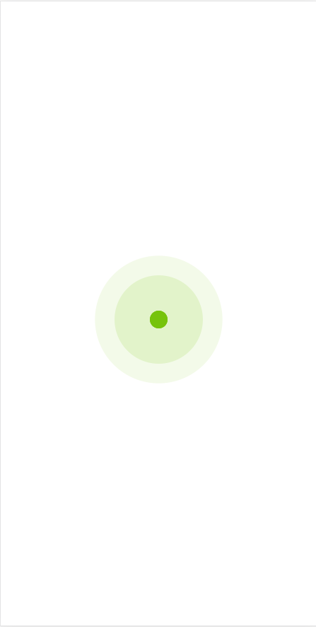

# A simple userlist example that uses Typescript and Redux-thunk.

## Introduction

A userlist demo that is responsive on multiple devices.

Loading animation and automatically loading when scrolls down the list.

## Screenshot

